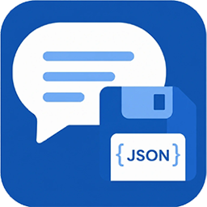

# &nbsp; Chat History Saver

Automatically saves your VS Code AI chat conversations (GitHub Copilot and custom chat providers) as clean Markdown files into a `chat-history/` folder at the root of each workspace.

Built for classrooms and teams: every conversation becomes a permanent, shareable record of what you asked, what the AI answered, and **which files were created or modified along the way**.

> Source & releases: [github.com/odetabadiagomez-art/chat-history-saver](https://github.com/odetabadiagomez-art/chat-history-saver)

## Why?

VS Code stores chat sessions in an internal `.jsonl` patch format inside `workspaceStorage`, which is easy to lose and impossible to read. This extension reconstructs each session and exports it as human-readable Markdown, automatically and continuously.

## Features

- 🔄 **Always-on auto-save** — watches the chat session storage and re-exports within seconds of any conversation activity. No clicks needed.
- 💬 **Clean conversation export** — user messages and assistant answers as proper Markdown.
- 📁 **File activity record** — every turn lists the files created 🆕, edited ✏️, and read 📖 during that moment of the conversation.
- 🎯 **Skills & agents tracking** — records which skills (e.g. `/cinematic-prompt-builder`) and subagents were used.
- 🛠️ **Tool summaries** (optional) — a collapsed one-line-per-tool-call log (commands run, files read…).
- 🧠 **Thinking blocks** (optional, off by default).
- 📋 **Session summary** — turns, models, agents, token usage, and the full list of touched files at the end of every export.
- 🖥️ **Status bar indicator** — shows how many chats are saved; click to open the folder.
- ⌨️ **Commands**:
  - `Chat History Saver: Save Chat History Now`
  - `Chat History Saver: Open Chat History Folder`

## Output format

One Markdown file per conversation in `chat-history/`:

```
chat-history/
  2026-09-20-frame-cinematography-lock-0de9b7bc.md
  2026-09-20-waylog-not-saving-conversations-1c514c4a.md
```

Each file contains YAML frontmatter (title, session id, dates, agents, models, skills, files touched), the full conversation turn by turn, per-turn file activity, and a session summary.

## Installation (for students)

1. Download the `chat-history-saver-<version>.vsix` file.
2. In VS Code: **Extensions view → `…` menu → Install from VSIX…** (or double-click the file).
3. Reload VS Code. Done — from now on every chat in every workspace is saved automatically to `chat-history/` in that workspace.

## Settings

| Setting | Default | Description |
| --- | --- | --- |
| `chatHistorySaver.enable` | `true` | Enable/disable automatic saving. |
| `chatHistorySaver.outputFolder` | `chat-history` | Folder (relative to workspace root) for the Markdown exports. |
| `chatHistorySaver.includeToolSummaries` | `true` | Include per-turn tool call summaries. |
| `chatHistorySaver.includeThinking` | `false` | Include assistant thinking/reasoning blocks. |
| `chatHistorySaver.exportOnStartup` | `true` | Export all existing sessions when VS Code starts. |

> 💡 If you don't want the history committed to git, add `chat-history/` to your `.gitignore`. If you *do* want to share it with your class, commit it!

## Development

```bash
npm install
npm run build        # bundle to dist/
npm run typecheck    # strict TS check
npm run package      # produce .vsix for distribution
```

Test the parser/exporter without VS Code:

```bash
node dist/cli.js "<path-to-workspaceStorage>/<hash>/chatSessions" /tmp/out [workspaceRoot]
```

## How it works

VS Code writes each chat session as an incremental-patch `.jsonl` file (`kind:0` = base object, `kind:1` = set value at path, `kind:2` = append to array). This extension replays the patches to reconstruct the full session, then extracts messages, file edits (`textEditGroup` / `codeblockUri` parts), tool invocations, skills, and agents, and renders them to Markdown.

## License

MIT
